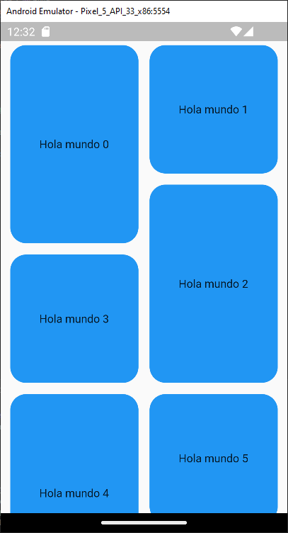

# d_pinterest_clone 
<!-- https://en.wikipedia.org/wiki/Markdown -->
<!-- https://docs.github.com/en/repositories/managing-your-repositorys-settings-and-features/customizing-your-repository/about-readmes  -->
Diseno de Layout al estilo Pinterest
## Appearance Application
  
 
<!--   -->

